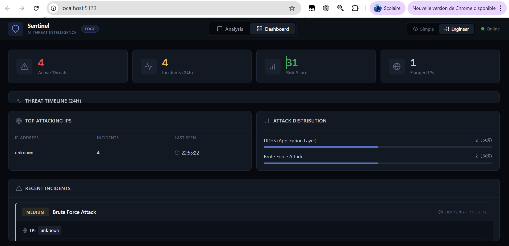
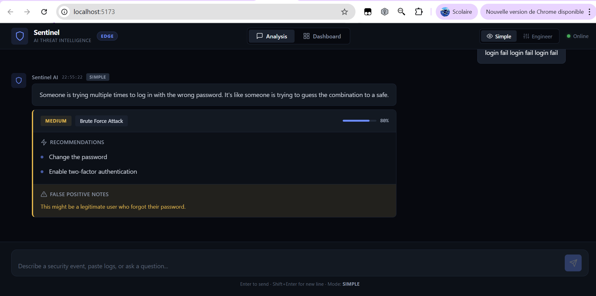
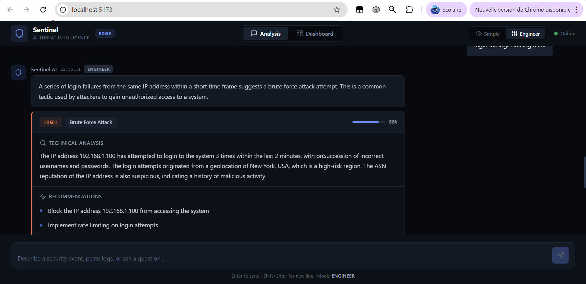
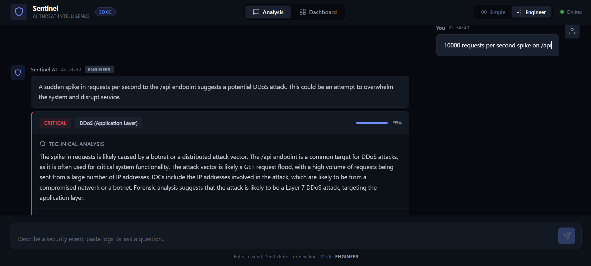
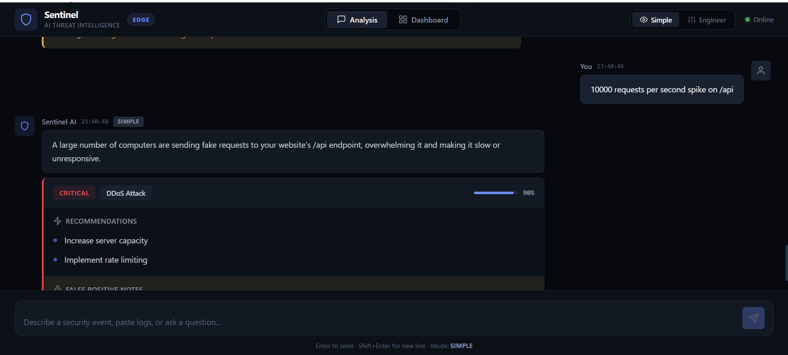

# Sentinel AI — AI-Powered Edge Security Intelligence System

Sentinel AI is an AI-powered cybersecurity assistant that analyzes network traffic logs in real time and detects potential security threats such as DDoS attacks, brute force attempts, and abnormal API behavior.

It provides structured, explainable security insights and runs as a cloud-edge application using Cloudflare Workers.

## Live Demo
https://your-project-url.pages.dev

## Demo
Run locally using Cloudflare Workers + frontend UI.

## Features

- Real-time security log analysis
- DDoS attack detection
- Brute force attack detection
- AI-powered threat explanation
- Engineer mode (technical deep analysis)
- Simple mode (human-readable explanation)
- Risk scoring system (LOW / MEDIUM / HIGH / CRITICAL)
- Structured JSON security output

## Tech Stack

- Cloudflare Workers (backend API)
- Cloudflare Pages (frontend UI)
- JavaScript / TypeScript
- AI-powered reasoning engine (rule-based or LLM)
- Edge computing architecture

## Architecture

```text
User → Frontend (Pages)
     → Worker API
     → AI Engine
     → Response
```

## Example: DDoS Detection

Input:
10000 requests per second spike on /api

Output:
- Risk: CRITICAL
- Type: DDoS (Application Layer)
- Confidence: 95%
- Action: Enable rate limiting, block IPs, monitor traffic

## Example: Structured JSON Output

```json
{
  "risk_level": "HIGH",
  "attack_type": "Brute Force",
  "confidence": 0.92,
  "explanation": "Repeated authentication failures from a single IP cluster targeting /login.",
  "technical_details": "12,000 POST requests/min with 99.8% failure rate indicates credential stuffing.",
  "recommendation": [
    "Enable rate limiting on /login (max 10 req/min per IP)",
    "Temporarily block suspicious IP ranges",
    "Activate CAPTCHA challenge after multiple failed attempts"
  ],
  "false_positive_notes": "Could be legitimate if traffic is from a large corporate NAT."
}
```

## Why this project matters

Traditional security tools require manual log analysis and complex dashboards.

Sentinel AI transforms raw network logs into real-time, explainable security intelligence using AI at the edge, reducing incident response time and making cybersecurity accessible and automated.

## How to Run

1. Install dependencies

```bash
cd worker
npm install
cd ../frontend
npm install
```

2. Run Worker locally

```bash
cd worker
npm run dev
```

3. Open frontend

```bash
cd frontend
npm run dev
```

## Future Improvements

- Integrate Workers AI (LLM-based reasoning) more deeply for adaptive detection
- Add persistent memory enhancements with Durable Objects
- Deploy global dashboard with multi-region visibility
- Real-time network monitoring with live stream ingestion

## Screenshots

### Dashboard


### Analytics — Simple Mode


### Analytics — Engineer Mode


### DDoS Detection — Engineer Mode


### DDoS Detection — Simple Mode

